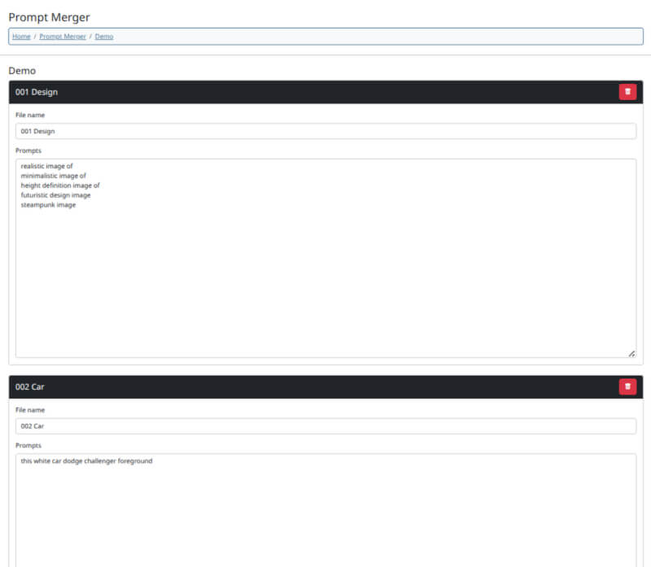
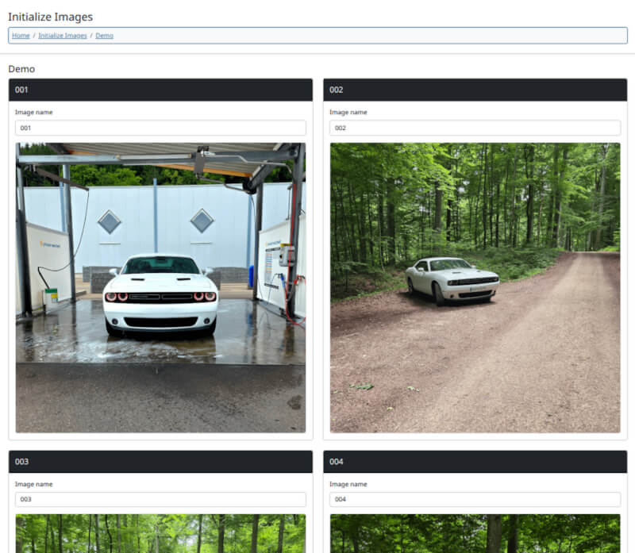
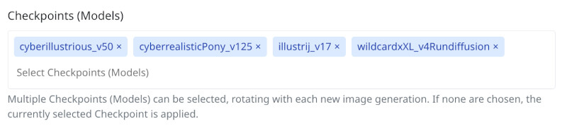
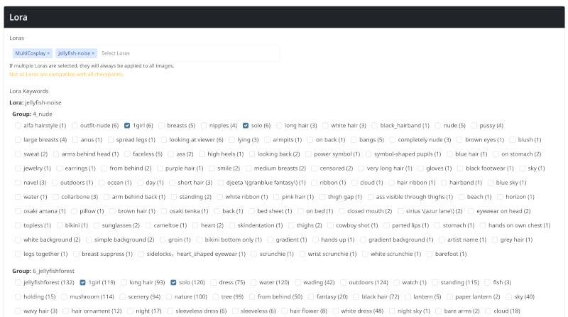
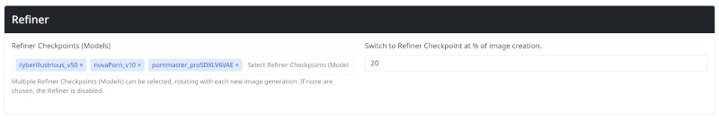
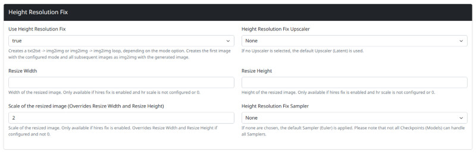

# Stable Diffusion Image Generator

A GNU Project by xtrose® Media Studio
  

### Web GUI and CLI API Mass Image Generator, Prompt Merger, Initialize Images Merger, Lora Handler, Text 2 Image Mode, Image 2 Image Mode, Loop Mode, Images Albums, Stable Diffusion Data Inspector
***

## Description
### Welcome to Stable Diffusion Image Generator!
Stable Diffusion Image Generator is a web-based GUI paired with a command-line application designed for high-volume image 
generation via Stable Diffusion APIs.

### Prompt Merger
A built-in Prompt Merger enables the generation of random prompts by combining entries from multiple text files. It 
supports an unlimited number of combinations, is fully configurable via the web GUI, and can be used for both prompts 
and negative prompts.  

### Initialize Images
For the Image2Image mode, you can create initialization directories that hold multiple input images for generation. 
These images are then processed one by one in sequence for Image2Image tasks.  

### Loop Mode
The experimental Loop mode generates the first image using either Text2Image or Image2Image, combined with the Prompt 
Merger and an optional initialization image. For all subsequent generations, the last recently generated image is used 
as the new initialization image in Image2Image mode.

### Checkpoint Cycle
The web-based GUI's generator supports configuring multiple checkpoints (models), which are cycled through automatically 
during batch generation. This enables a wide range of stylistic variation and offers a deeper understanding of each 
model's strengths and output characteristics.  

### Sampler Cycle
The web-based GUI's generator supports configuring multiple samplers (methods), which are cycled through automatically 
during batch generation. This feature provides a quick way to evaluate the behavior of different samplers. Please note 
that not all checkpoints (models) are compatible with every sampler. In some cases, an incompatible combination may 
produce a blank image.  

### Lora Handler
The Stable Diffusion Image Generator’s web-based GUI gives you full control over Loras. It detects all available Loras in 
your Stable Diffusion setup, lets you activate them with a click, and provides a complete list of associated keywords 
with adjustable weights. Keyword hunting is no longer necessary. The tool automatically injects the configured Lora 
settings into your prompt.

### Refiner Cycle
The web-based GUI's generator allows you to define multiple refiner checkpoints (models), which are automatically 
rotated on each image generation. You can also set the weights for the refiners to control their impact on the final 
output.

### Upscaler
The web-based GUI's generator allows you to define a fixed height resolution for upscaling your generated images. You 
can configure the upscaler, sampler, and output image size directly within the interface. However, since the upscaling 
process is resource-intensive and time-consuming, we recommend using external tools like Upscayl for enlarging images. 
These tools are significantly faster and more energy-efficient.  

### Images Album
In addition, the web-based GUI features a fully customizable image gallery where you can store, copy, and manage your 
generated images with ease. Each image is saved along with all relevant metadata, including the checkpoint (model), 
prompt, refiner, and other generation parameters — allowing you to fully trace and reproduce the generation process at 
any time.  

### Stable Diffusion Data Inspector
The Stable Diffusion Data Inspector is a web-based GUI that allows you to inspect the data of a Stable Diffusion 
checkpoints (models), samplers, upscalers and loras.
***

## Dependencies
- Stable Diffusion Instance with API access (local or remote)
- PHP >= 8.3
***

## Setup
### General
- Clone or download GIT Repository  
  $ git clone https://github.com/xtrose/stable-diffusion-image-generator.git

### Web Application
- Navigate to root directory of your local Instance
- Start Web-Application  
  $ php start-web-application.php
- Open Web Application in Browser
  http://localhost:8000
- Select Menü <b>Image Generator</b> -> <b>Settings</b>
- Set up your Stable Diffusion host
- Select Menü <b>Image Generator</b> -> <b>Prompt Merger</b>
- Set up your Prompt Merger Files
- Select Menü <b>Image Generator</b> -> <b>Image Generator</b>
- Set up Generator
- Have fun with mass image generation

### CLI
While the command-line application offers features not available in the web version, it can be difficult to configure. 
For most users, we strongly recommend using the web application.
- Navigate to root directory of your local Instance
- Copy <b>config.inc.php</b> to config.local.php
- Set your Stable Diffusion Host and Port to <b>$this->host</b>
- Set <b>$this->dryRun</b> to <i>true</i>
- Run CLI Application to get the file <b>checkpoints.json</b>, <b>loras.json</b>, <b>options.json</b>, 
<b>samplers.json</b> and <b>upscalers.json</b>
- Use the Stable Diffusion files to configure the config.local.php file. Configuration information can be found below in 
the Config section.
- Set <b>$this->dryRun</b> to <i>false</i>
- Run CLI Application  
  $ php run.php 
***

### CLI options

- --help: Help  
- -h: Help  
- --start-web-application: Start Build-In-Server with web application only on http://localhost:8000  
- --kill: Kill all silent applications in background  
- -k: Kill all silent applications in background  
- --config [file]: Run with custom config file in the root directory  
- -c [file]: Run with custom config file in the root directory
***

## Config

### The three configuration files:
- <b>config.inc.php</b>: This configuration file belongs to the GitLab repository and should never be modified.
  Copy the contents of the original config.inc.php configuration file into a new file named config.local.php for the CLI
  application.
- <b>config.local.php</b>: This configuration file is used by the CLI application. To customize it, copy the contents of 
  config.inc.php into this file. If this file is absent, the CLI will automatically load the default configuration from 
  config.inc.php.
- <b>config.web.php</b>: This configuration file is automatically created and managed by the web application. You should 
  not modify this file, as doing so could lead to issues with the web application's functionality. If you encounter 
  problems with the web application, delete this file so that it can be automatically recreated.

### CLI Custom configuration file:
Separate configuration files can be manually created for the command-line application. To do this, copy the 
config.inc.php file to another .php configuration file in the root directory and customize it as needed. Run the CLI 
application using the <b>--config MY-CUSTOM-CONFIG-FILE.php</b> parameter to use your custom configuration file.

### Configuration Parameters
- <b>$this->host </b><i>[string]</i>: The host and port where the stable diffusion API is running.
- <b>$this->startWebApplication </b><i>[bool]</i>: Start PHP Build-In server for the Web-Application.
- <b>$this->numberOfImages </b><i>[int, null]</i>: The number of images to generate. If set to null or 0, the script 
  will generate unlimited images.
- <b>$this->loop </b><i>[bool]</i>: Creates a txt2txt -> img2img or img2img -> img2img loop, depending on the mode option. 
  Creates the first image with the configured mode and all subsequent images as img2img with the generated image.  
  <i><b>Warning</b>: Will automatically enable saveImages if enabled.</i>
- <b>$this->dryRun </b><i>[bool]</i>: If true, only settings will be checked and no images will be created.
- <b>$this->mode </b><i>[string]</i>: The mode to use. Can be txt2img or img2img. If img2img is selected, the Stable 
- Diffusion img2img settings has to set correctly and the init images directory has to be set.
- <b>$this->checkpoint </b><i>[string, array, false, null]</i>: String of the checkpoint name, array from multiple 
  checkpoints, null for all checkpoints are used in turn, false for selected checkpoint.
- <b>$this->sampler </b><i>[string,array,null</i>]: String of the sampler name, array from multiple samplers, null for 
  default sampler (Euler).
- <b>$this->prompt </b><i>[string, null]</i>: The directory where the prompt generator files are located. A 
  subdirectory in prompt directory where prompt files for prompt merging are located. If set to null, the images wil be 
  generated with empty prompt.
- <b>$this->negativePrompt </b>[string, null]: The directory where the prompt generator files are located. A 
  subdirectory in prompt directory where prompt files for prompt merging are located. If set to null, the images wil be 
  generated with empty negative prompt.
- <b>$this->initImages </b><i>[string, null]</i>: The directory where the images to be initialized are located. A 
  subdirectory in init_images directory where initialize images are stored. Only available if mode is img2img.
- <b>$this->width </b><i>[int]: The width of the generated images.
- <b>$this->height </b><i>[int]: The height of the generated images.
- <b>$this->steps </b><i>[int]: The number of sampling steps to use for the generation.
- <b>$this->refinerCheckpoint </b><i>[string, array, null]: String of the refiner checkpoint name, array from multiple 
  refiner checkpoints, null for deactivate refiner checkpoint.
- <b>$this->refinerSwitchAt </b><i>[float]</i>: Float 0.0 - 1.0 when checkpoint switch to refiner checkpoint. Set 0.5 to 
  set checkpoint should switch to refiner checkpoint at 50% of image creation.
- <b>$this->restoreFaces </b><i>[bool]</i>: Option restore faces and remove artifacts.
- <b>$this->tiling </b><i>[bool]</i>: Tiling to generate seamless textures.
- <b>$this->Lora </b><i>[string, array, null]</i>: String of the Lora name, array from multiple Loras, null for disable 
  Lora.
- <b>$this->LoraKeywords </b><i>[string, null]</i>: Keywords to trigger special trained action of Loras.
- <b>$this->enableHr </b><i>[bool]</i>: Enable or disable hires fix. Only available in txt2img mode.
- <b>$this->hrUpscaler </b><i>[string, null]</i>: Upscaler type string for specified upscaler, null for default upscaler 
  (Latent). Only available if hires fix is enabled.
- <b>$this->hrResizeX </b><i>[int, null]</i>: Width of the resized image. Only available if hires fix is enabled and hr 
  scale is null.
- <b>$this->hrResizeY </b><i>[int, null]</i>: Height of the resized image. Only available if hires fix is enabled and hr 
  scale is null.
- <b>$this->hrScale </b><i>[float, null]</i>: Scale of the resized image. Only available if hires fix is enabled. 
  Overrides hr resize width and height if not null.
- <b>$this->hrSamplerName </b><i>[string, null]</i>: Sampler type for hires. Only available if hires fix is enabled. 
  Default sampler if null (Euler).
***